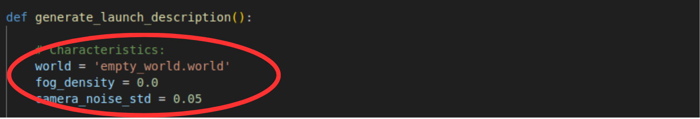

# FAA-Gazebo-Environment
***
## Dependencies
The Gazebo Simulations of Detect and Avoid (DAA), focused on generating detection confidence levels under varying visual environmental factors (such as visual clutter, fog, and camera noise), require several Python libraries and ROS 2 dependencies:

### ROS 2 Dependencies
The project requires ROS 2 Humble and Gazebo Classic software for the implementation of the simulations.

### OpenCV
This project depends on OpenCV as a bridge between ROS 2 camera messages and RGB image formats. OpenCV is used to convert sensor_msgs/Image messages into formats that can be processed by the YOLO object detection model, and to generate videos of the camera sensors during simulations.

```bash
pip install opencv-python
```

### YOLO
The simulations use YOLO as the visual detection system for identifying aircraft in the camera field of view of the own-ship.

```bash
pip install ultralytics
```
### Gazebo-dev
gazebo-dev is used as a dependency to build custom Gazebo plugins and install them into the Gazebo plugin library.

```bash
sudo apt update
sudo apt install libgazebo11-dev
```

### Unzipping larger files:
The Installation of the models used in the worlds downloads big zip files from Google Drive, gdown is required to accept the download when the setup.sh is running.
```bash
pip install gdown
```

### Obtaining faster image detection:
To generate fast YOLO deteection using the 5 cameras mounted in the ownship, the simulation needs to compute the images using GPU. Therefore, in case your computer has a NVDIA graphic card, the computer can use CUDA's platform as a general-purpose GPU computing. Run the next command to see if your computer already supports CUDA. 
```bash
nvcc --version
```
It the command is not found, install teh CADA toolkit and test it again:
```bash
sudo apt update
sudo apt install nvidia-cuda-toolkit
```

### Recursive Sub-modules
The simulations used a customized version of the plugin [GPS Multipath Plugin](https://github.com/landwy/gnss_multipath_plugin) for Gazebo, redesigned to be added to any model and to calculate a velocity estimation. This plugin depends on [libpredict](https://github.com/la1k/libpredict). Both of these packages are added as recursive sub-modules to the repository.


***
## Installation 

The installation process requires cloning the repository with its recursive sub-modules and running the `setup.sh` script to install additional large files into the `src` directory.

### Steps:

```bash
git clone --recurse-submodules https://github.com/Darkjrcy/FAA-Gazebo-Environment.git
cd FAA-Gazebo-Environment
bash setup.sh
```

***
## Generate New Worlds
The process to generate new worlds for you Gazebo Simulation is presented in [World Generator](src/plane_bringup/README.md)


***
## Run the Detection Simulations
The Repository contains three main detection simulations, each one with their own launch file and characteristics.

## MIT Encounter Set Simulator.
The ROS2 pacakge has a mit_path_follower executable, which les you simulate the intruder and ownship movements defined in the MIT DAA encoutner sets. To cahneg the encounter sets go to the src/plane_bringup/launch/MIT_Trajectory_follower.launch.py file and change the encounter set list. The program woudl simulate that encounter sets adn save the airplane and detection infromation in the DATA/MIT_Fligths folder. 
```python
# Launch follower varaibles:
    ownship_name = "airplane_1"
    intruder_name = "airplane_2"
    encounter_list = "125,123,2689" # Add how many encounter sets you want in the string "encounter_1,encounter_2,..."
    use_gpu = True # CHnage in case you want to use GPU in the YOLO detection model.
```
To run the executbale you only need to launch the file using the ros2 command:
```bash
ros2 launch plane_bringup MIT_Trajectory_follower.launch.py 
```

**IMPORTANT:** Before running the simulations, you must add the MIT encounter set data file [data.zip](https://www.ll.mit.edu/r-d/datasets/unmanned-aircraft-terminal-area-encounters) in src/plane_follow_exec/DATA/.
 to src/plane_follow_exec/DATA/. Additionally, if you want to use the MIT encounters list with the nearest CPA to use detection add the file [terminal_encounter_info_20200630.csv](https://www.ll.mit.edu/r-d/datasets/unmanned-aircraft-terminal-area-encounters) in the folder src/plane_bringup/Detection_encounters/.

 ### MIT Encounter Set Simulator with Variable number of cameras.
This launch file is similar to MIT_Trajectory_follower.launch.py. It simulates the MIT trajectory encounter but lets you define how many cameras the ownship uses for intruder detection. To set the number of cameras, change the camera mode of the respective airplane to '3.0', and set the desired count in camera_numbers inside MIT_variable_cam_Trajectory_follower.launch.py. It also requires updating the DATA path to enable the data-collection workflow.
 ``` python
# Spawn the airplanes:
    airplanes = [ownship_name,intruder_name]
    camera = ['3.0', '0.0']
    camera_numbers = ['3', '0']
    launch_descriptions_airplanes = []
    launch_description_delete_airplanes = []
```
To run the simualtion use the executable:
``` bash
ros2 launch plane_bringup MIT_variable_cam_Trajectory_follower.launch.py 
```

## Simulation Characteristics:
Every launch file has variables to modify the DAA scenario by modifying the visual detection, senors meassurements or the camera clutter. 

### 1. World File
If you want to change the world used by one of the launch files, open the corresponding launch file, locate the world configuration parameters, and change the file name.



The Simualiton environment containst 4 different world:
* **MIT_city.world:** The largest world containing the Hanscom Airforce base sourrandings with an urban area of 10 mi by 10 mi.
* **empty_world.world:**  An empty Gazebo world that contains allt he pluggins required to run the simulations.
* **ERAU.world:** the Embry Riddle Aeronautical University Campus in Daytona Beach.
* **NewYork.world:** A small section of the New Yowk Times Square.
* **Mountains.world:** Small section of the Rocky mountains. 

#### 2. Fog Density
The fog density value used for the data recollection is  changed in the same section that the world file is changed. However, to adjust the fog density in the simulation, open the world file, navigate to the <scene> section, and modify the fog density value to match the input specified in the launch file parameters. For exmaple:

```xml
    <scene>
      <ambient>0.4 0.4 0.4 1</ambient>
      <background>0.7 0.7 0.7 1</background>
      <shadows>1</shadows>
      <fog>
        <color>0.7 0.7 0.7 1</color>
        <type>exp</type>
        <density>0.0</density> <!-- Change this value so it matches with the input of the Characteristics-->
      </fog>
    </scene>
```

### 3. Camera noise
To change the zero mean standard deviation of the camera noise go to the gazebo.xacro file of the Airplane model locates in src/plane_description/urdf/.../airplane_gazebo.xacro and change the camera_noise_stddev property, so it matches the input specified in the launch file parameters. For exmaple:

```xml
<?xml version="1.0"?>
<robot name="airplane_sim" xmlns:xacro="http://ros.org/wiki/xacro">

    <xacro:arg name="robot_name" default="airplane_X"/>
    <xacro:arg name="robot_imu" default="imu_X"/>
    <xacro:property name="camera_noise_stddev" default="0.05"/> <!-- Change this value to add or decrease the zero mean stadard deviation noise of the camera -->
```


